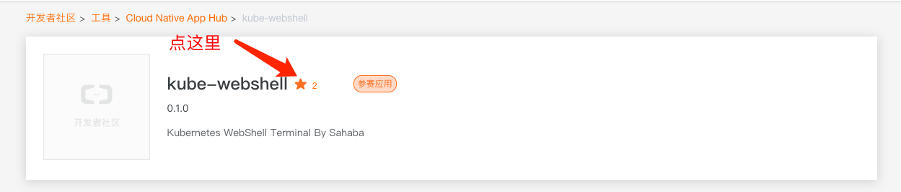

# Kube-WebShell
Kubernetes WebShell Terminal By Lifeng

## 云原生应用开发大赛

 本项目已参加 [阿里云原生应用开发大赛](https://developer.aliyun.com/hub/detail?spm=a2c6h.12873679.0.0.61811107Si0gaZ&name=kube-webshell&version=0.1.0)  
请各位大佬帮忙点个赞，谢谢。


本项目已提交至阿里云原生应用仓库
使用helm apphub快速安装使用：

```bash
helm repo add apphub https://apphub.aliyuncs.com/
helm install apphub/kube-webshell
```
**注意:使用apphub默认安装后，没有kubeconfig文件所以无法连接任何集群，请自行替换secret中的config文件，或使用以下方法安装**
```bash
git clone https://github.com/lf1029698952/kube-webshell.git
cd kube-webshell/helm-chart
```
将目标集群的kubeconfig文件内容替换至kubeconfig.toml文件下，支持多集群contexts配置，然后执行：
```
helm install kube-webshell ./
```

本项目在[web-terminal-in-go](https://github.com/du2016/web-terminal-in-go)的基础上进行了优化改造。  
参考kube-dashboard提取出来的容器网页版控制台，通过web浏览器连接k8s容器。  

基于xterm.js和sockjs实现，简单轻量，可与任何Kubernetes集群集成，根据自己的需求定制。  
需要提供kubeconfig文件，通过uri传参即可，使用时传递以下参数：  

- context
- namespace
- podname
- containername

## 功能

- 多集群支持
- web终端实现，自带心跳保活
- 自适应浏览器窗口并动态调整tty大小
- 支持用户权限控制 [TODO] 
- 支持用户操作日志审计 [TODO] 


## 使用:
### docker 运行
```docker pull springwar/kube-webshell:latest```  

将app.conf和kubeconfig文件放至/opt/kube/conf路径下(可自定义), 并且执行以下命令:  
```docker run -d --name kube-webshell -p 8080:8080 -v /opt/kube/conf/:/opt/kube/conf springwar/kube-webshell:latest ```  

app.conf配置文件示例:
```
appname = kube-webshell
httpport = 8080
kubeconfig = /opt/kube/conf/config
```

打开浏览器访问8080端口即可。


### Helm 安装
支持helm安装：

#### Prerequisites

- Kubernetes 1.6+
- helm 2.8.0+

#### Installation
```
git clone https://github.com/lf1029698952/kube-webshell.git
cd kube-webshell/helm-chart
```
将目标集群的kubeconfig文件内容替换至kubeconfig.toml文件下，支持多contexts集群配置，然后执行：
```
helm install kube-webshell kube-webshell
```

#### 配置values.yaml文件

可在values.yaml中修改如下配置，或在helm install中使用--set选项

- **Ingress**: The ingress controller must be installed in the Kubernetes cluster.  
- **ClusterIP**: Exposes the service on a cluster-internal IP. Choosing this value makes the service only reachable from within the cluster.
- **NodePort**: Exposes the service on each Node’s IP at a static port (the NodePort). You’ll be able to contact the NodePort service, from outside the cluster, by requesting `NodeIP:NodePort`. 
- **LoadBalancer**: Exposes the service externally using a cloud provider’s load balancer.  

### 访问
使用Ingress暴露服务时，绑定host或解析webshell.example.local域名，直接浏览器访问即可  
使用NodePort暴露服务时，浏览器直接访问NodeIP:NodePort  
使用ClusterIP时，外部无法直接访问，使用port-forward命令将服务暴露至本地：
```
kubectl port-forward <PodName> 8080:8080
```
浏览器访问localhost:8080  

如图：


演示：
[kube-webshell](docs/images/kube-webshell.mov)

